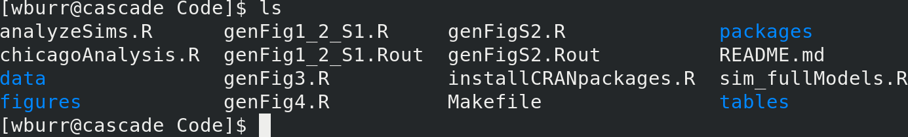

class: inverse

```{r include=FALSE}
library(ggplot2)
filter <- dplyr::filter
knitr::opts_chunk$set(warning=FALSE, message=FALSE, fig.width=10.5, fig.height=4, 
  comment=NA, rows.print=16)
theme_set(theme_gray(base_size = 24))
```

## Steps Toward Reproducible Research

Making your research reproducible is the goal. It's not trivial!

---

class: inverse

## This is not original ...

Full acknowledgement: I ripped off most of these slides from a statistician named Karl Broman at UW-Madison. He's the person who introduced me to the core concepts.

---

class: inverse

## This has happened to me ...

```{r, eval = FALSE}
Wesley, received the report, looks interesting. However, I see that 
you only have results up to 2013 - why have you not used the latest 
data up to 2016? Can you re-do the analysis?
  - (a colleague of mine at Health Canada)
```

---

class: inverse

## And so has this ...

<div style="font-size: 30px; font-style: bold;">
The results in Table 1 don’t seem to correspond to those in Figure 2.
</div>

---

class: inverse

## And this ...

<div style="font-size: 30px; font-style: bold;">
How did I get those results again? What order did I run all this code in ... ?
</div>

---

class: inverse

## And this ...

<div style="font-size: 30px; font-style: bold;">
Where did this data come from?
</div>

---
class: inverse

## And this ...

<div style="font-size: 30px; font-style: bold;">
How did this processed data set get made? Where did those weird data records go?
</div>

---

class: inverse

## And this ...

<div style="font-size: 30px; font-style: bold;">
This code that used to work is now erroring ...
</div>

---

class: inverse

## And this ...

<div style="font-size: 30px; font-style: bold;">
"The attached is similar to the code we used." 
(actual quote from another researcher)
</div>

---

class: inverse

## $\;$

<br/>

<div style="font-size: 60px; font-style: bold;">
<center>
Reproducible <br>
<span style="color: #0000FF;">versus</span> <br>
Replicable
</center>
</div>

---

class: inverse

## Levels of Research (Code) Quality

▶ Are the tables and figures reproducible from the code
and data?<br>
▶ Does the code actually do what you think it does?<br>
▶ In addition to **what** was done, is it clear **why** it was
done? <br>
(e.g., why did you omit those six subjects?)<br>
▶ Can the code be used for other data?<br>
▶ Can you extend the code to do other things?<br>

---

class: inverse

## 1. Everything should be scripted

If you'll do something (with data or code) once, you'll do it 1000 times.

---

class: inverse

## 2. Organize your data and code

```{r, eval = FALSE}
File organization and naming are powerful weapons against chaos.
- Dr. Jenny Bryan (UBC and RStudio)
```

---

class: inverse

## 2. Organize your data and code

```{r, eval = FALSE}
Your closest collaborator is you six months ago, but you don’t 
reply to emails.
- Dr. Mark Holder (UBC-Okanagan)
```

```{r, eval = FALSE}
... looking at code from six months ago which appears to have 
been written  by a stranger, possibly an insane stranger ...
- Dr. Hadley Wickham, Chief Scientist, RStudio (2016)
```

---

class: inverse

## 2. Organize your data and code

Directory structure! Coherent and straightforward process within scripts.

<br/>



<br />

(and this is a not particularly good example - I've learned a lot since 2013)

---

class: inverse

## 3. Automate the process (GNU Make)

Not strictly necessary for science, but invaluable for **reproduciblity**. We can talk more about this in the future ...

---

class: inverse

## 4. Turn scripts into reproducible reports

This is what we're going to show you today!
